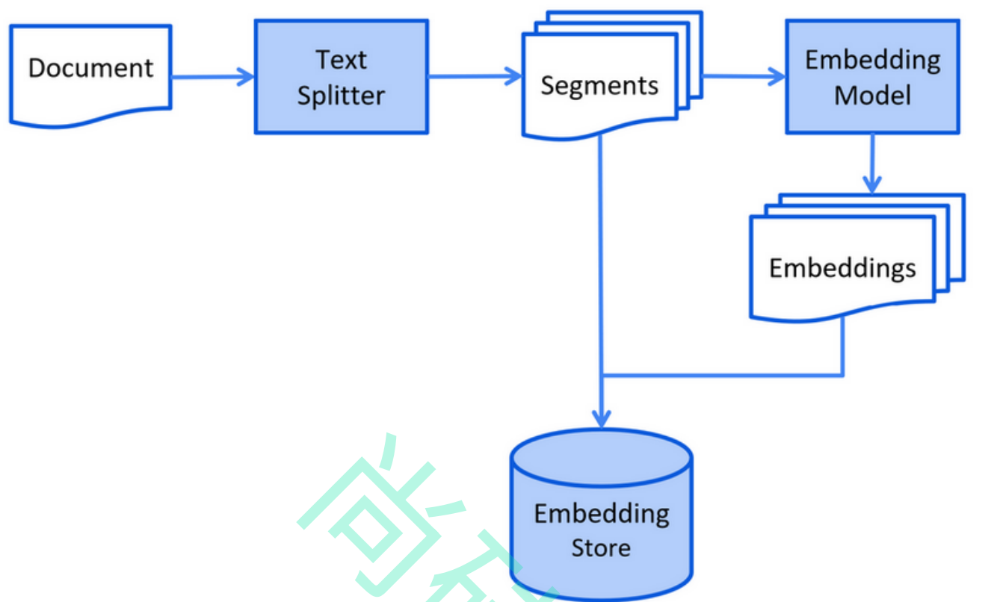
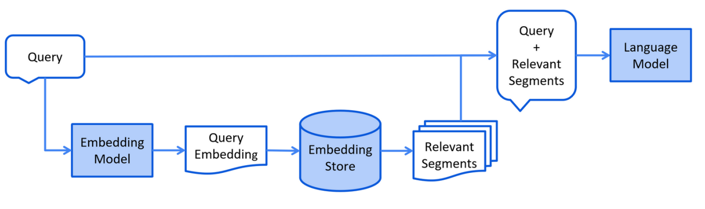

## RAG常用方法
- 全文搜索
- 向量搜索
- 混合搜索
## RAG过程
1. 索引阶段
   1. 加载知识库文档 ==> 将文档中的文本分段 ==> 利用向量大模型将分段后的文本转换成向量 ==> 将向量存
      入向量数据库
      
2. 检索阶段
   1. 通过向量模型将用户查询转换成向量 ==> 在向量数据库中根据用户查询进行相似度匹配 ==> 将用户查询
      和向量数据库中匹配到的相关内容一起交给LLM处理
   
